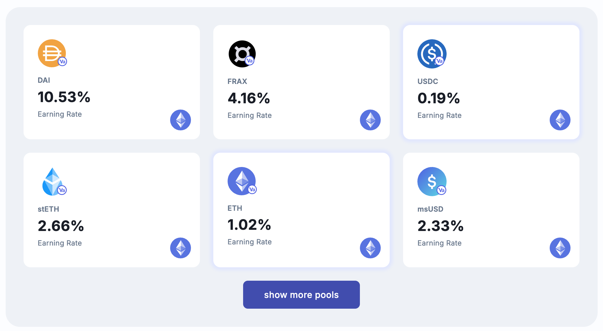

# Real-Time Crypto Pool Earnings

This feature uses jQuery to fetch and display real-time earning rates from a cryptocurrency API. It updates the rates every 10 seconds to keep the data current.

## Features

- Fetches earning rates for various cryptocurrency pools
- Uses jQuery for asynchronous API requests
- Updates rates automatically every 10 seconds
- Seamless real-time UI updates without refreshing the page

## Usage

- The script automatically sends a request to the API every 10 seconds.
- It parses and updates the DOM elements displaying the earning rates.

## Sreenshot

